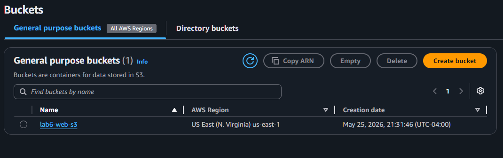
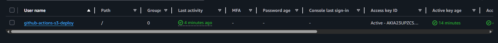
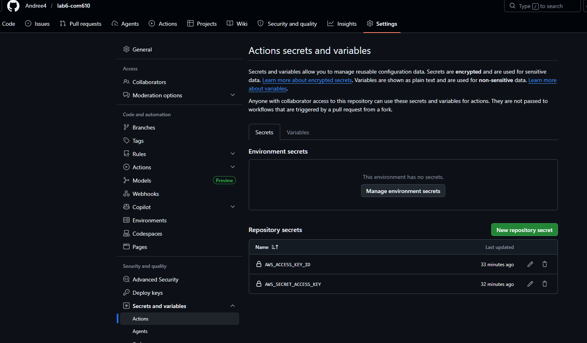
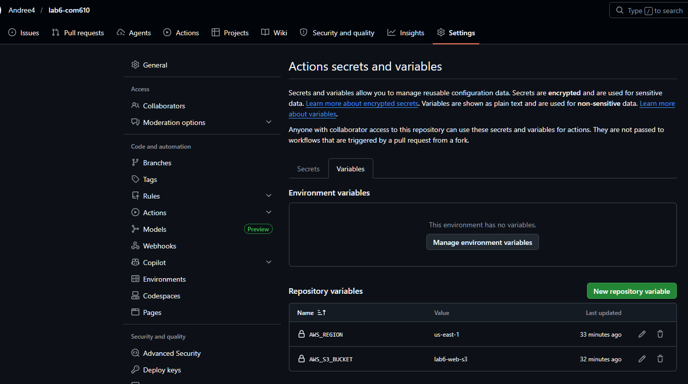
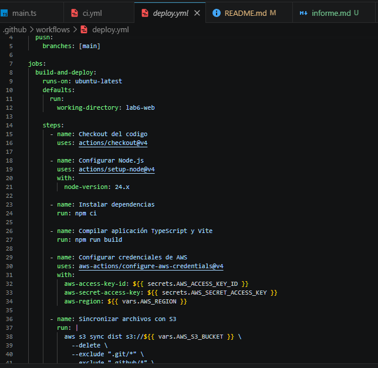
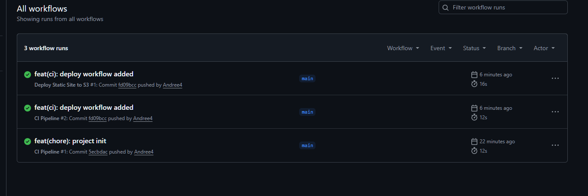
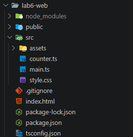
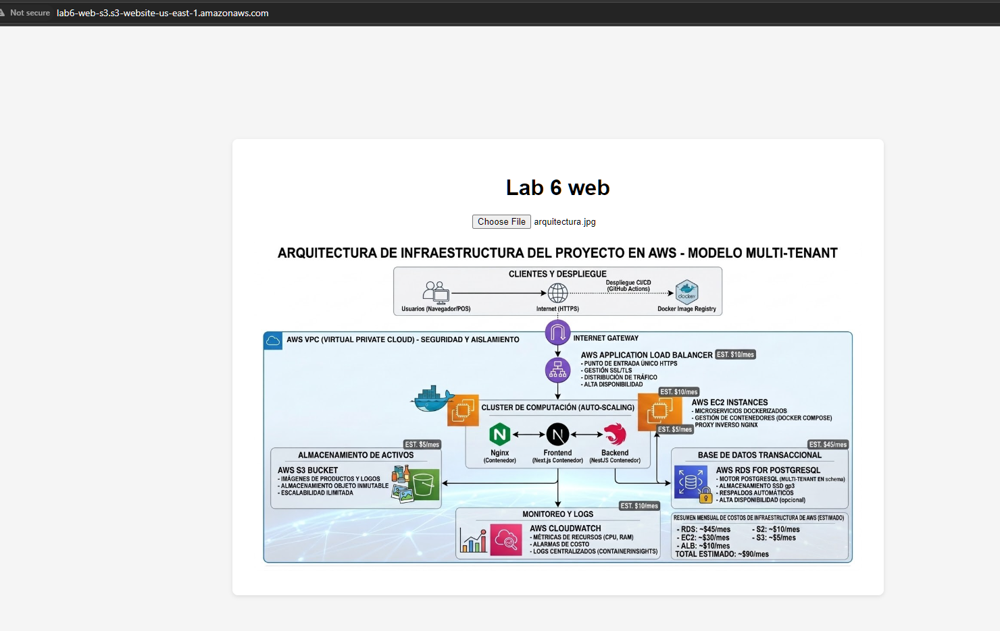
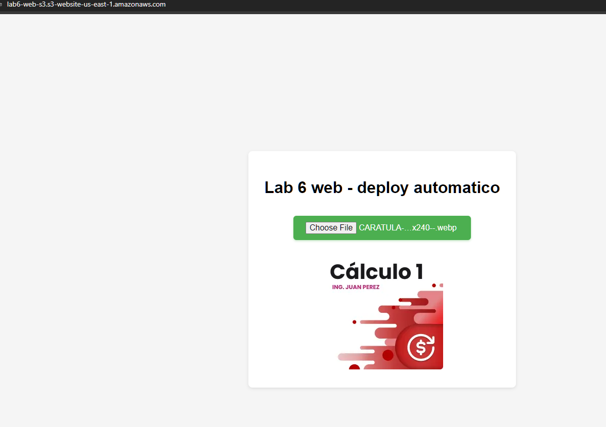

# Laboratorio 6.1: Despliegue de una Aplicación Web Estática con CI/CD

**Alumno:** Arancibia Aguilar Daniel Andree  
**Fecha:** Mayo 2026  
**Asignatura:** Computación en la Nube

---

## **1. Objetivo del Laboratorio**

Implementar un pipeline completo de **Continuous Integration / Continuous Deployment (CI/CD)** para desplegar una aplicación web estática en **Amazon S3**, utilizando **GitHub Actions** como orquestador de despliegue automático.

---

## **2. Descripción del Proyecto**

Se desarrolló una aplicación web estática utilizando **Vite**. El objetivo fue configurar un flujo automatizado que, al hacer push o merge a la rama principal, compile la aplicación y la despliegue automáticamente a un bucket de Amazon S3 configurado como sitio web estático.

**Tecnologías utilizadas:**

- Frontend: Vite
- Hosting: Amazon S3 (Static Website Hosting)
- CI/CD: GitHub Actions
- Autenticación: IAM User + GitHub Secrets

---

## **3. Recursos Configurados en AWS**

**Bucket S3 para Hosting Estático**

**Usuario IAM con permisos para S3**

---

## **4. Configuración en GitHub**

**Secrets configurados en el repositorio**

**Variables de GitHub**

---

## **5. Pipeline CI/CD (deploy.yml)**

**Archivo de Workflow: `.github/workflows/deploy.yml`**

**Historial de Workflows en GitHub Actions**

---

## **6. Evidencias del Despliegue**

**Proyecto desarrollado con Vite**

**Aplicación Web Estática Desplegada**

**Actualización exitosa de la aplicación (despliegue automático)**

---

## **7. Conclusiones **

Este laboratorio permitió implementar un pipeline completo de **CI/CD** para aplicaciones web estáticas, logrando:

- Automatización total del proceso de despliegue.
- Reducción significativa del tiempo entre desarrollo y producción.
- Uso seguro de credenciales mediante GitHub Secrets.
- Hosting económico y escalable con Amazon S3.
